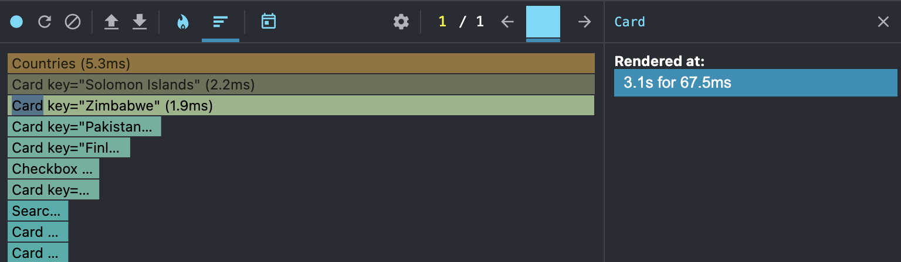
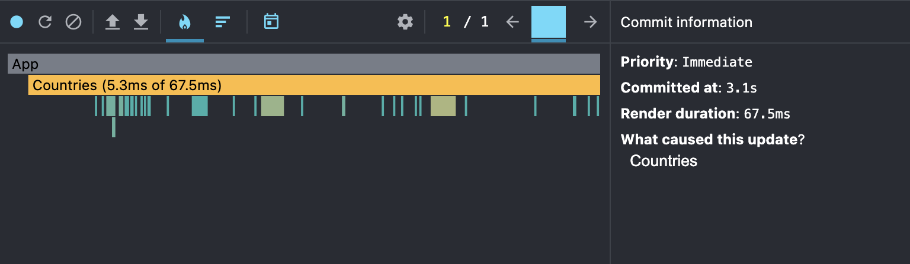
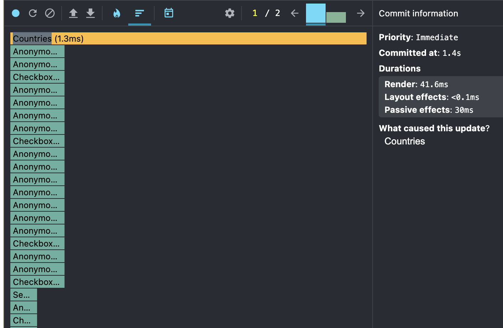
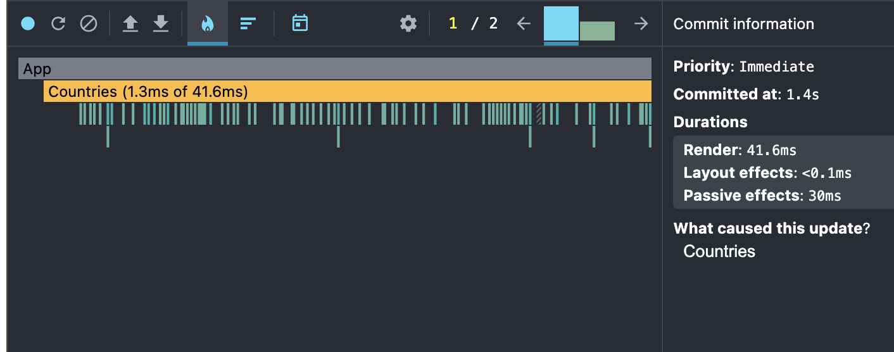

# Performance Profiling Task

## Initial Profiling with React Dev Tools Profiler 

## Sort by population 

- **Commit Duration**: 
  - 67.5ms
This is the total time React took to render the updates after the sort action.
- **Render Duration**: 
  - `Countries`: 5.3ms.
  - `Card`: 2.2ms (per item)
- **Flame Graph**: 
  - The Countries component took the majority of the rendering time, which is expected as it handles the list of    countries.
  - Each Card component rendered quickly, indicating efficient rendering of individual items.
- **Ranked Chart**: 
  - Countries was the most time-consuming component, followed by multiple Card components.

Screenshots:
  Below are the screenshots from the React Dev Tools Profiler:

## Sort by Population after optimization

- **Commit Duration**: 
  - 41.6ms
- **Render Duration**: 
  - `Countries`: 1.3ms.
  - `Card`: 0.2ms (per item)
 - **Flame Graph**:
  - The Countries component rendering time decreased significantly.
  - Each Card component now renders even faster, showing the impact of optimizations.
- **Ranked Chart**:
  - Countries remains the most time-consuming component, but its render time has improved.
  - Card components now render much faster, reducing the overall load.

## Comparison of Performance Before and After Optimization

- **Commit Duration**:
Before Optimization: 67.5 ms
After Optimization: 41.6 ms
Improvement: 38.4% faster

- **Render Duration**:
`Countries` Component:
Before Optimization: 5.3 ms
After Optimization: 1.3 ms
Improvement: 75.5% faster

`Card` Component:
Before Optimization: 2.2 ms (per item)
After Optimization: 0.2 ms (per item)
Improvement: 90.9% faster
